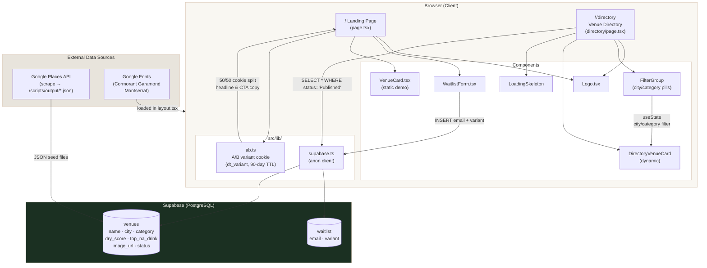

# Dry Trip — App Architecture

## Key Design Decisions

| Decision | Detail |
| --- | --- |
| No API routes | Components query Supabase directly via `useEffect` |
| A/B testing | Cookie-based, 50/50 split, 90-day TTL — landing page only |
| Publishing control | Only `status = 'Published'` venues surface in directory |
| Client-side filtering | City/category filters run in-browser on already-fetched data |
| Image hosting | All venue images served from Google Places CDN URLs |
